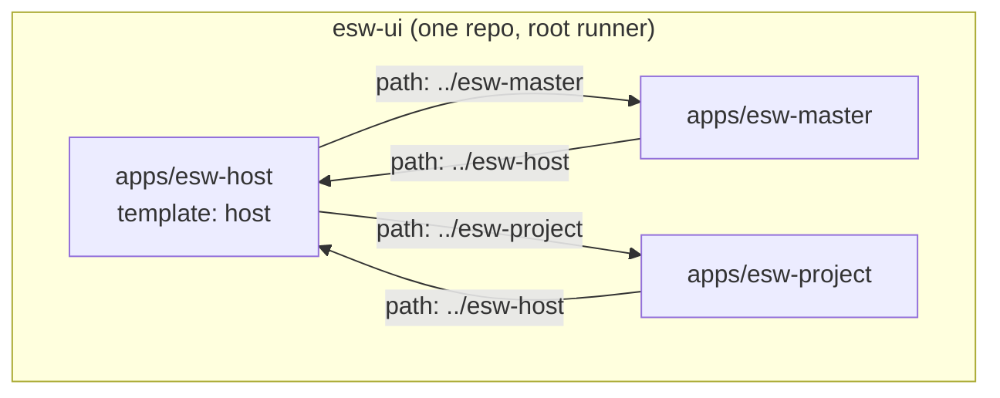

# Mono-Lith

A **mono-lith** is the mono ecosystem with every app in ONE repository, each in its own folder, connected by `apps[].path` instead of a GitHub clone. The host reads its remotes in place — dev, build, `mono prepare` and `mono sync` all look at the same sibling directory — and editing a remote hot-updates the running host.

It is the same federation as [Mono-Repo](/repo/getting-started): a host compiles its remotes' pages, components, composables and stores as its own, and a remote run standalone borrows the host's shell. What changes is *where the other app lives*:

| | Mono-Repo (sync) | Mono-Lith (path) |
|---|---|---|
| One app = | one repository | one folder under `apps/` |
| Remotes reach the host by | `mono sync` → `.mono/apps/<name>` clone | `apps[].path: '../<name>'` |
| Editing a remote | push → `mono sync` on the host | the running host hot-updates |
| A build reads | the clone | the sibling |
| Lifting one app out | it already is its own repo | copy the folder; `url` takes over |



Every arrow is a line in that app's own `mono.config.ts`. Each folder keeps carrying its own config, its own `package.json` and its own `pnpm-workspace.yaml` — so the folder can still be lifted out into a standalone checkout, where the sibling is gone and `mono sync` falls back to the `url`.

## Layout

```
esw-ui/
├── package.json            # the runner: dev / build / test via Vite+ (vp)
├── pnpm-workspace.yaml     # apps/* + catalogs (lib versions), one install
├── .npmrc                  # the mono-libs registry for mono-*, npmjs for the rest
├── vite.config.ts          # vite-plus: lint defaults + vitest projects
└── apps/
    ├── esw-host/           # the shell — template: 'host'
    │   ├── mono.config.ts  # apps: [{ name: 'esw-project', path: '../esw-project', … }]
    │   ├── vite.config.ts  # + monoLith()
    │   └── src/
    ├── esw-master/         # apps: [{ name: 'esw-host', path: '../esw-host', … }]
    └── esw-project/        # apps: [{ name: 'esw-host', path: '../esw-host', … }]
```

Nothing under `apps/<app>/.mono/apps` is needed any more: `mono sync` reports each path app as **🔗 linked** and clones nothing. A stale clone left there from before is shadowed by the sibling and left alone.

## The config

The host names its remotes by path and declares itself the shell:

```ts
// apps/esw-host/mono.config.ts
export default defineConfig({
  name: 'esw-host',
  type: 'vue',
  template: 'host',   // own layouts only, never a remote's
  apps: [
    { name: 'esw-master',  path: '../esw-master',  url: 'https://github.com/org/esw-master/tree/mono',  type: 'vue' },
    { name: 'esw-project', path: '../esw-project', url: 'https://github.com/org/esw-project/tree/mono', type: 'vue' },
  ],
  // env / fetching / menu / … exactly as before
})
```

Each remote names the host back, so it can run standalone with the host's shell:

```ts
// apps/esw-project/mono.config.ts
apps: [
  { name: 'esw-host', path: '../esw-host', url: 'https://github.com/org/esw-host/tree/mono', type: 'vue' },
]
```

`path` is relative to the file that declares it and must be a **static string literal with forward slashes** — the config is text-parsed before it can be executed. Everything about the rule is in [Config: path and url](/lith/config).

## When `url` still matters

Keep the `url` beside the `path`. It costs nothing in the lith (`path` wins whenever the directory exists) and it is what makes a folder portable:

- **Lifted out.** Copy `apps/esw-project` somewhere on its own: `../esw-host` is absent, `mono sync` clones the host from the `url` into `.mono/apps/esw-host`, and the app runs exactly as a Mono-Repo remote.
- **CI that checks out one app.** Same story — the sibling is not there, the clone is.
- **A `path` with no `url`** is fine too, but then a missing directory is an error rather than a fallback: there is nothing to sync from.

## Running it

From the root (see [Root runner](/lith/root-runner)):

```bash
pnpm install          # once, at the root — one node_modules for every sibling
pnpm dev              # vp run --filter esw-host dev   → the host, with both remotes live
pnpm dev:project      # esw-project standalone, wearing the host's shell
pnpm build            # the host bundle, remotes included, from the same siblings
```

Best practice is to develop and build **through the host**: that is the bundle that ships. Running a remote on its own is for working on it in isolation, and still reads the real host next door.
