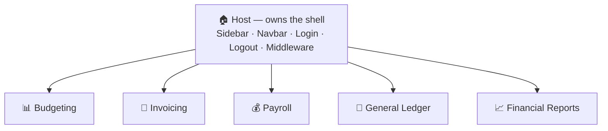

# Getting Started

Mono-repo is a way to build a large-scale, modular front-end on top of the Vue ecosystem. The goal is a maintainable, clean, complex project that takes minimum effort to grow.

## Concept

Vue gives every project the same predictable shape:

- `src/pages` — routing
- `src/layouts` — layouts

Inside a layout you usually find the same generic pieces: **Sidebar**, **Navbar**, **Login**, **Logout**, **Middleware**. Every normal website needs them.

Mono-repo makes this simple. Those generic pieces live once in the **Host**, and every **Remote** can use them without rebuilding.

A **Remote** only adds its own modules. It does not re-create Login, Logout, or any of the generic things — the Host already handles all of that.

Because of this modular concept, the Host can have many Remotes, and all of them live inside the Host. Think about a house that have many rooms.

A Host can be a **Vue** app or a **Nuxt** app — and the **Host and its Remote must have the same framework**: a Vue Host takes Vue Remotes, a Nuxt Host takes Nuxt Remotes. Joining a Nuxt Host with a Vue Remote is still possible, but it is a **risky hybrid** outside the standard. See [Setup](./setup) for how each kind is wired.

## Visual Example

One **Host** owns the shell; each finance module plugs in as its own **Remote**:



**Host** — owns the shell of the app.

```
host/
└── src/
    ├── pages/         # login, logout, etc.
    ├── layouts/       # sidebar, navbar, etc.
    └── ...etc/
```

> A **Nuxt** Host uses `app/` instead of `src/` (same folders inside). See [Setup](./setup).

**Remote** — just adds modules, for example a Budget module.

```
remote/
└── src/
    ├── pages/         # budget module
    └── ...etc/
```

## Install

You don't build a Host or a Remote from scratch — download a template, install, done.

<RepoTemplates />

### Run it

Inside each folder you downloaded — the Host and the Remote:

```sh
pnpm i
pnpm mono:sync
```

That's it — the template already ships every dependency it needs.

Next, head to [Setup](./setup) to wire your Host and Remote. For the UI components and
theming, continue with [Mono-UI → Getting started](/ui/getting-started) and [Theme](/ui/theme).
