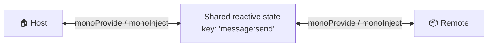

# Provide and Inject

You can communicate between Remote and Host, or Host and Remote, using the provide-and-inject concept. It can send a string, number, object, or array — and it stays reactive.

Both sides share one reactive payload through a common key — either side can provide it and either side can inject it:



Let's say this is a Remote that needs to send data — use `monoProvide`:

```vue
<script setup lang="ts">
import { ref } from 'vue'
import { monoProvide } from '@mono-lit/utility/runtime'

const message = ref('')

monoProvide({
  key: 'message:send',
  syncRef: message,
})

const sendMessageToHost = () => {
  message.value = 'Hello from Remote'
}
</script>

<template>
    <button @click="sendMessageToHost()">
      Send
    </button>
</template>
```

On the Host side, you can receive the state as long as it shares the same key:

```vue
<script setup lang="ts">
import { monoInject } from '@mono-lit/utility/runtime'

const message = monoInject({
  key: 'message:send',
  defaultValue: ''
})
</script>

<template>
   <div>
    {{ message }}
   </div>
</template>
```

This case is kind of unique and rare. For now, the feature already using it is sending menu data from Remote to Host.
