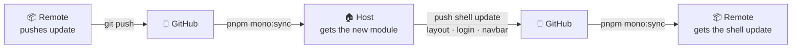

# Sync

The Host and the Remote live in separate repositories. **@mono-lit/utility** keeps them in step, and both the [Mono Host](https://github.com/mono-lit/templates/tree/main/vue-host) and the [Mono Remote](https://github.com/mono-lit/templates/tree/main/vue-remote) (in the `mono-lit/templates` monorepo) ship with it installed.

Sync flows **both ways**, through GitHub. Neither side talks to the other directly — each one pushes to GitHub, and the other picks the change up on its next sync:



A Remote pulls in shell updates from the Host; the Host pulls in each Remote's new modules.

::: tip Working with the repos side by side?
Put every app in one repository as sibling folders and connect them by `apps[].path` — no sync round-trip, and the host hot-updates when a remote changes. See [Mono-Lith](/lith/getting-started).
:::

## Setup Sync

Both templates use these files:

```
mono-vue-remote/
├── .mono/
│   ├── apps/                # synced remotes land here
│   └── tsconfig.json        # generated path aliases (see Prepare)
├── mono.config.ts
├── package.json
├── .env.dev
└── .env
```

Everything mono generates lives under one gitignored `.mono/` folder. You never edit it by hand.

### mono.config.ts

Lists the apps to sync. On a Remote, list your Host here:

```ts
import { defineConfig, JWTCompleteTokenTypes } from "@mono-lit/utility/runtime";

export default defineConfig({
    name: 'mono-remote',
    apps: [
      {
        name: 'mono-host',
        url: 'https://github.com/mono-lit/templates/tree/main/vue-host',
        envToken: 'MONO_TOKEN'
      }
    ]
});
```

The `url` carries the ref directly, GitHub-style:

- `…/mono-vue-host` — the `main` branch
- `…/mono-vue-host/tree/v4.0.7` — a tag
- `…/mono-vue-host/tree/feat/layout-program` — a branch (slashes are fine)
- `…/mono-vue-host/tree/deac44a955ac63981e6bae705f5df3f2d61dcf0f` — a commit SHA

### .env and .env.dev

`envToken` names a [GitHub token](https://github.com/settings/tokens) kept in `.env` or `.env.dev`:

```
MONO_TOKEN=YOUR_GITHUB_TOKEN
```

It is **optional** — if everyone who syncs the app has been invited to its repo, `mono sync` uses your own git credentials and never needs a token.

### package.json

The sync script:

```json
{
  "scripts": {
    "mono:sync": "mono sync && mono prepare",
    "mono:prepare": "mono prepare",
    "postinstall": "mono sync && mono prepare"
  }
}
```

## Run Sync

```
pnpm mono:sync
```

Each app in `mono.config.ts` is downloaded into `.mono/apps/`. `mono prepare` then regenerates `.mono/tsconfig.json`, so the new app's `@<name>` alias is available to TypeScript right away.
